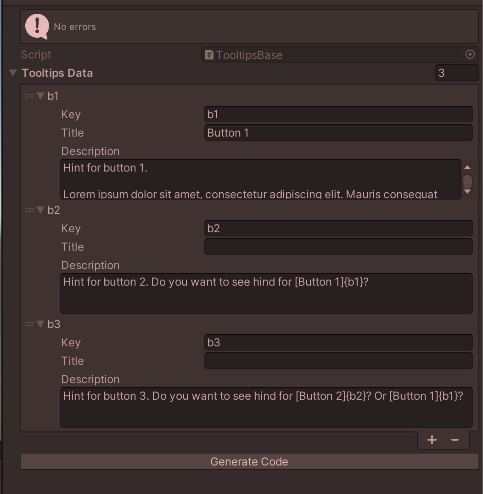
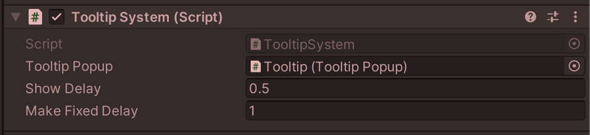
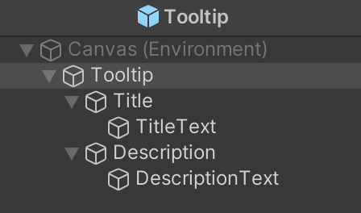

## UI tooltip system

This is a simple <b>UI Tooltip System</b> inspired by a similar one in <b>Crusader Kings III</b>. It's a very basic implementation that will help you get started creating similar hints.


<b>Unity version - 2021.3.12f1</b>

### Basics

The show/hide popup of the tooltip is currently done through a static API:

```csharp
TooltipSystem.Show(key);
TooltipSystem.TryHide(key);
```

The TooltipTrigger class can serves you as a simple example of API usage.

```csharp
public sealed class TooltipTrigger : MonoBehaviour, IPointerEnterHandler, IPointerExitHandler
{
    [SerializeField] private TooltipKeys key;
    public void OnPointerEnter(PointerEventData eventData) => TooltipSystem.Show(key);
    public void OnPointerExit(PointerEventData eventData) => TooltipSystem.TryHide(key);
}
```

However, you may want to inject it through DI. It wan't made in the example to keep the code simple. Tooltip creation happens in the TooltipsFactory class, with simple pooling, so it will be easy to replace it with your DI Container's factory implementation.

### Tooltip Terms Base

In the `TooltipsBase`, you can add `Keys`, `Description` texts, and an optional `Title`. Currently, it is located in the Resources folder, but it can be easily modified to load via addressables.

You will also likely need to localize it, it will be easy to do, for example in the TooltipSystem class.

</img>

When you add keys, you can generate an enum with them, which simplifies working in the code. But be careful when deleting terms. Currently, it is not validated, so the maximum you will get is a runtime error.

### Tooltip States

There are four states for the tooltip:
- `Preparing`: the cursor is over item, but the tooltip is waiting for delay to be shown (`Show Delay`).
- `Shown`: the tooltip is shown, waiting for an delay to be fixed (`Make Fixed Delay`).
- `PreFixed`: the tooltip is conditionally fixed, but the cursor has not yet been pointed at it, so closing this tooltip is still controlled by the object that called the tooltip.
- `Fixed`: the cursor was pointed at the tooltip, and now closing the tooltip is controlled by the tooltip itself.

Settings for `Show Delay` and `Make Fixed Delay` are both located on the `TooltipsCanvas` GameObject.

</img>

### Tooltip Prefab

`Tooltip Prefab` made as simple as possible. You can redesign is wherever you like, just make sure to keep the set of components on the root GameObject. Adding Tooltip animations should also be easy, as the code is very simple.

Art for UI is taken from this asset: [Clean Settings UI](https://assetstore.unity.com/packages/tools/gui/clean-settings-ui-65588)

</img>
